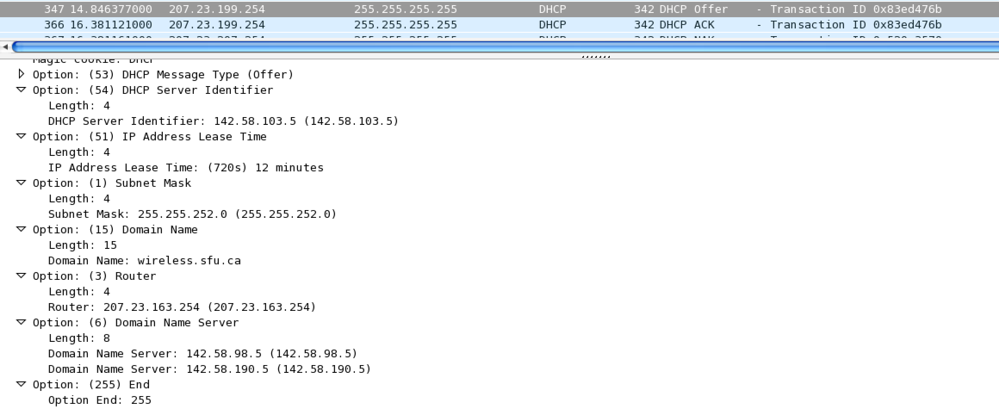
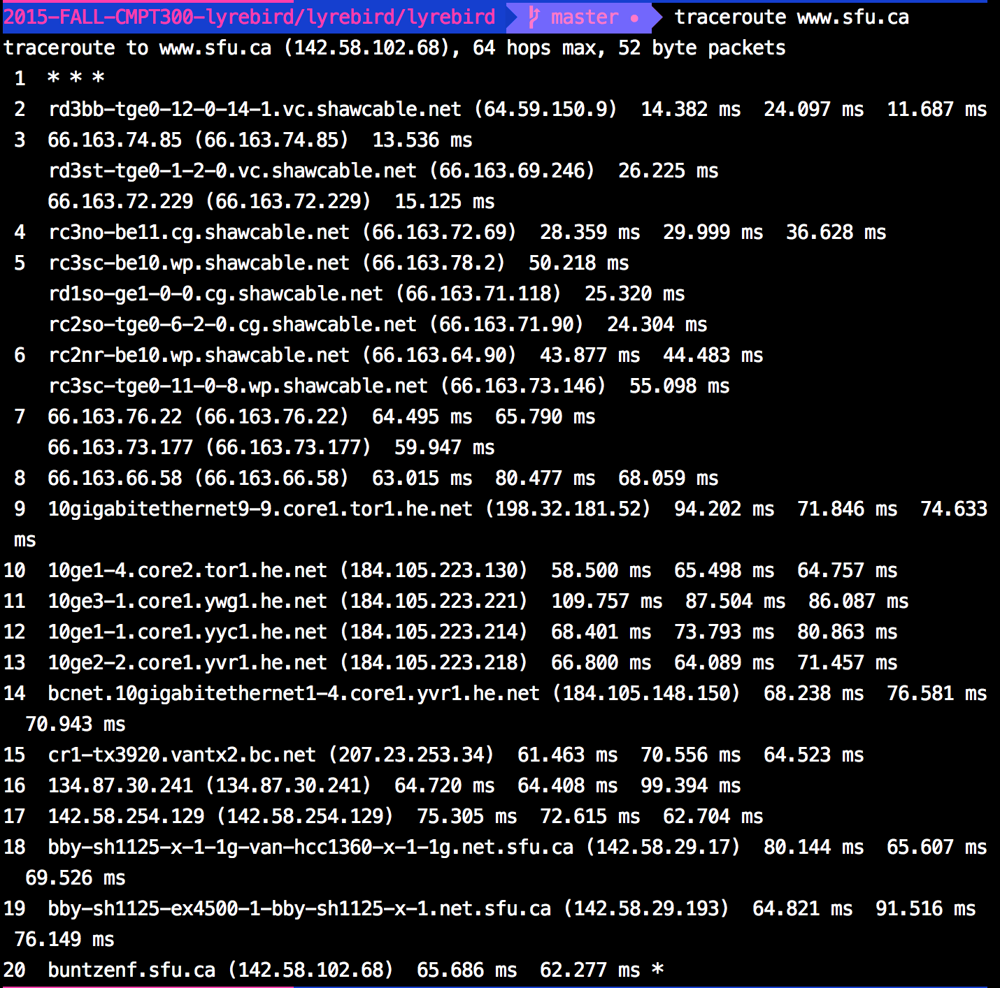
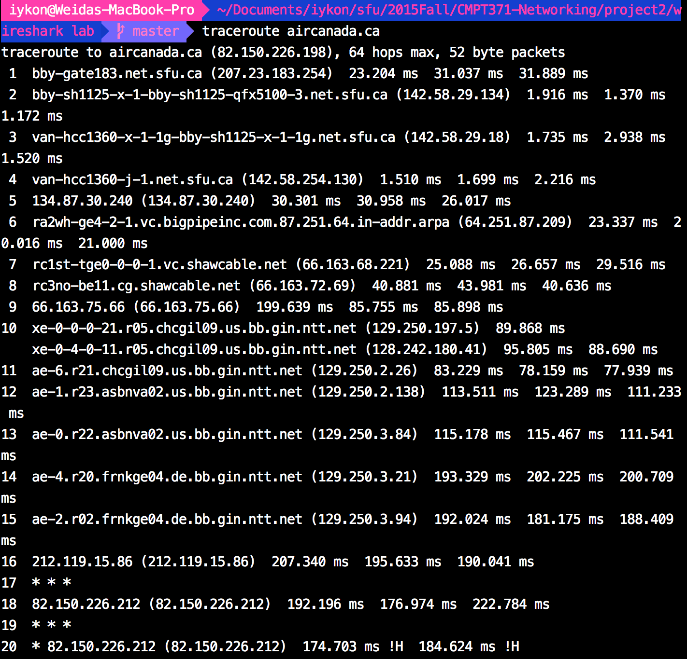

# CMPT371 Project 2 Lab
##### Weida Pan 301295773
### 4. (10%) Try to identify the network topology of the SFU campus network. We’re not expecting a perfect answer for it; just try your best using the knowledge you’ve learnt so far. For example, you can Traceroute to different servers and then identify a rendezvous and branches.

This is the screenshot of DHCP offer packet when I was in SFU campus.
I was offered the IP of 207.23.161.9. And the DHCP server has IP of 142.58.103.5. And there are two domain name servers, one 142.58.98.5, the other 142.58.190.5. And there is an option telling me "Router" is 207.23.163.254. 
When I was in CSIL lab, my computer had an IP address of 142.58.35.17.
 
Based on information above, the subnet of SFU has the IP prefix of 142.58.0.0/16. There is two domain name servers and a DHCP server. SFU also has a subnet of wireless network, and the subnet mask is 255.255.252.0. And 207.23.163.254 is the IP address of a router which connects the subnet of wireless network and wired network of SFU campus.

This is the screenshot of my terminal when I was tracerouting www.sfu.ca at home.

This is the screenshot of my terminal on my laptop when I was tracerouting aircanada.ca at SFU campus. 
So I guess the 17th host with IP 142.58.254.129 might be the router to which the subnet of SFU network connected. And 142.58.254.130 might be the router to which the network out of SFU canmpus is conneted. 
When a host wants to send packet inside SFU network it should pass router 142.58.254.129 and when host inside SFU network wants to send packet outside SFU network it should pass router 142.58.254.130. I guess they are two different interfaces of a router.
