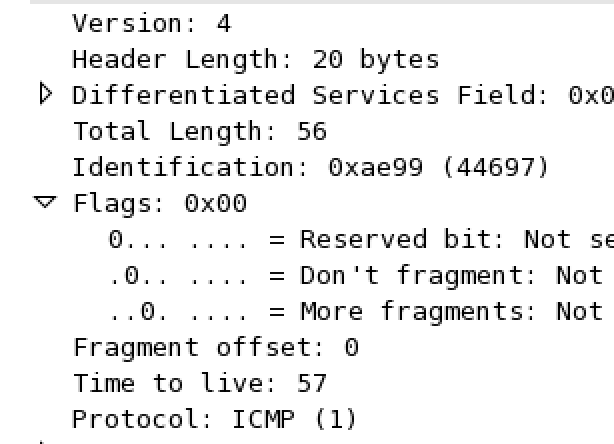
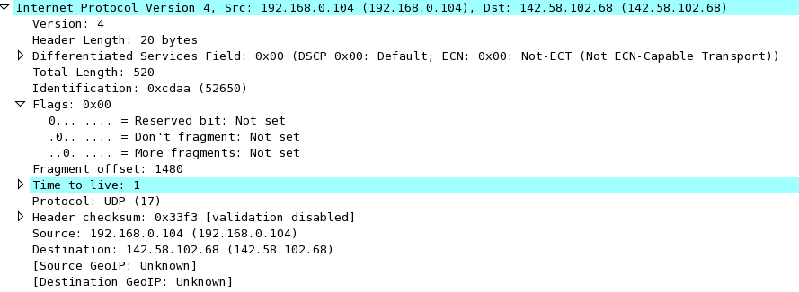

# CMPT371 Project 2 Lab
##### Weida Pan 301295773
## IP
#### 1.

My computer IP address is 192.168.0.104.
#### 2.
See the screen shot in Q1. 
The value is UDP.
#### 3.
See the screen shot in Q1. 
Header length is 20 bytes. Payload is total length minus header length is 36 bytes.
#### 4.

Since more fragments is not set, this IP datagram is not fragmented.
#### 5.
Identification, time to live and checksum.
#### 6.
Version, header length, total length, flags, fragment offset, protocol, source and destination stay constant. 
Version, header length, total length, flags, fragment offset, UDP protocol, source and destination must must stay constant. Reason are, respectively, we use IPv4, according to the protocol, we set total bytes as 56 bytes, according to protocol, datagram is not fragmented, upper layer protocol is UDP, source IP is the IP of this computer which is fixed, destination IP is also fixed. 
Identification, time to live, checksum must change. The first and third change in order to distinguish each packet, the second is because the distance of the packets is going further.
#### 7.

Identification is a 16 bits number. And the value increases by one as is in the next packet.
#### 8.

The value of Identification is 44697. The value of TTL is 57.
#### 9.
The first packet:

The second packet:

The third packet:

The Identifications change, but not TTL. These packets are different, and identification is used to distinguish them. But the distance remains the same, so TTL doesn't change.
#### 10.

Yes.
#### 11.

In the flag field, more segments is set. 
The fragment offset being 0 indicates this fragment is the first. 
This datagram is in total 1500 bytes.
#### 12.

The fragment offset being 1480 indicates this is not the first fragment. But there is no more fragments since more fragments in this datagram is not set.
#### 13.
Total length, flag,  fragment offset, header checksum.
#### 14.

Totally three fragments.
#### 15.
Flag, total length, fragment offset, header checksum.
