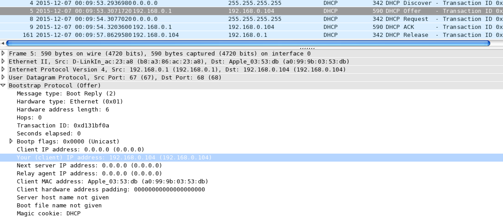

# CMPT371 Project 2 Lab
##### Weida Pan 301295773
## DHCP
#### command:

#### 1.

Over UDP.
#### 2.

packet 1: source port is 68, destination port is 67. 
packet 2: source port is 67, destination port is 68. 
packet 3: source port is 68, destination port is 67. 
packet 4: source port is 67, destination port is 68. 
Yes.
#### 3.

The link-layer address is a0:99:9b:03:53:db.
#### 4.

Option 53, one is discover, the other is request.
#### 5.
They are all 0xd131bf0a. The second is 0x20b86883. The purpose is to make four DHCP messages as a serious of segments thus to identify different hosts or different request from one host.
#### 6.

My computer uses 0.0.0.0 as source IP and 255.255.255.255 as destination IP address. The server uses 192.168.0.1 as source IP address and 192.168.0.10 as destination IP address.
#### 7.
Server has IP address 192.168.0.1.
#### 8.

Server offers 192.168.0.104 which is in Your (client) IP address field.
#### 9.

Relay agent IP address being 0.0.0.0 indicates there is no relay agent.
#### 10.
The router information is for cases where client wants to reach network outside the subnet. 
The subnet mask is for cases where wants to send request inside subnet.
#### 11.

No. It is in packet of Request of request field.
#### 12.

It is the longest time the host can use this IP. After that, the host will have to request for an IP again. 
In my experience, the lease time is 7 days.
#### 13.
The purpose of DHCP release message is to tell server this client gives up this IP address so that this IP address can be assigned to other clients. Server doesn't issue an acknowledge. If it is lost, this IP address is not available until lease time is passed.
#### 14.

Yes, there were some ARP messages. The purpose is to make sure there is no other client using a certain IP address before server offers it to one client.
