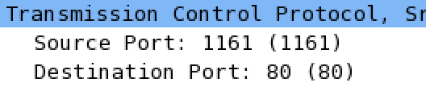

# CMPT371 Project 2 Lab
##### Weida Pan 301295773
## TCP
screen shot for q1 and q2.
screen shot for q1 and q2.
#### 1.
IP address of client computer is 192.168.1.102. TCP port number is 1161.
#### 2.
IP address of gaia.cs.umass.edu is 128.119.245.12. On port 80.
#### 3.

For my computer, IP address is 192.168.0.104 and port number is 56866.
#### 4.

The sequence number is 0.

The flag field of 0x002 identifies the segment to be SYN segment.
#### 5.

Sequence number is 0. The value of acknowledgement field is 1. The acknowledgement number is set to be sequence number + 1. The flag filed of 0x012 identifies the segment as a SYNACK.
#### 6.

The sequence number of that is 1.
#### 7.

The first six segments: 
Sequence &nbsp;&nbsp;&nbsp;time received &nbsp;&nbsp;&nbsp;&nbsp;&nbsp;&nbsp;&nbsp;time ACK received &nbsp;&nbsp;difference &nbsp;&nbsp;&nbsp;&nbsp;&nbsp;RTT 
1 &nbsp;&nbsp;&nbsp;&nbsp;&nbsp;&nbsp;&nbsp;&nbsp;&nbsp;&nbsp;&nbsp;&nbsp;&nbsp;&nbsp;&nbsp;&nbsp;&nbsp;20:48:22.1275350  20:48:22.2316600 &nbsp;&nbsp;&nbsp;0.1041250s &nbsp;0.1041250s 
677 &nbsp;&nbsp;&nbsp;&nbsp;&nbsp;&nbsp;&nbsp;&nbsp;&nbsp;&nbsp;&nbsp;&nbsp;&nbsp;20:48:22.1275830 20:48:22.2387160 &nbsp;&nbsp;&nbsp;0.1111330s &nbsp;&nbsp;0.1111330s 
2125 &nbsp;&nbsp;&nbsp;&nbsp;&nbsp;&nbsp;&nbsp;&nbsp;&nbsp;&nbsp;&nbsp;20:48:22.1275840 20:48:22.2493000 &nbsp;&nbsp;&nbsp;0.1217160s &nbsp;0.1217160s 
3573 &nbsp;&nbsp;&nbsp;&nbsp;&nbsp;&nbsp;&nbsp;&nbsp;&nbsp;&nbsp;&nbsp;20:48:22.2317340 20:48:22.3459380 &nbsp;&nbsp;&nbsp;0.1142040s &nbsp;&nbsp;0.1142040s 
5021 &nbsp;&nbsp;&nbsp;&nbsp;&nbsp;&nbsp;&nbsp;&nbsp;&nbsp;&nbsp;&nbsp;20:48:22.2388030 20:48:22.3503440 &nbsp;&nbsp;&nbsp;0.1115410s &nbsp;&nbsp;0.1115410s 
6469 &nbsp;&nbsp;&nbsp;&nbsp;&nbsp;&nbsp;&nbsp;&nbsp;&nbsp;&nbsp;&nbsp;20:48:22.2388040 20:48:22.3635840 &nbsp;&nbsp;&nbsp;0.1247800s &nbsp;&nbsp;0.1247800s 
ERTT1 = RTT1 = 0.1041250s 
ERTT2 = (1-0.125)\*ERTT1 + 0.125\*RTT2 = 0.1050010s 
ERTT3 = (1-0.125)\*ERTT2 + 0.125\*RTT3 = 0.1070904s 
ERTT4 = (1-0.125)\*ERTT3 + 0.125\*RTT4 = 0.1079796s 
ERTT5 = (1-0.125)\*ERTT4 + 0.125\*RTT5 = 0.1084248s 
ERTT6 = (1-0.125)\*ERTT5 + 0.125\*RTT6 = 0.1104691s 
#### 8.

The lengths of first six segments are 676B, 1448B, 1448B, 1448B, 1448B, 1448B.
#### 9.

From the first segment from receiver, the minimum window size is 122. 

Yes. There is once the sender encounters a situation where TCP window is full.
#### 10.

From the chart we know that there is no retransmission.
#### 11.
Typically receiver acknowledges from sequence number it was waiting last time to the largest sequence number it receives this time.

Receiver is ACKing every other received segment.
#### 12.

This is the throughput graph generated by wireshark. 
For the throughput of whole transmission section, total bytes transferred is 149414B. The whole process takes 3.2949020s. So throughput is 149414B/3.2949020s = 45347B/s.
#### 13.

Slow start is at 0-0.1s. 
Congestion avoidance happens at 0.1-0.2s. 
After 0.3s the number of sequence grows steadily, which means the window size keeps the same. And there is no triple ACKs nor time out.
#### 14.

Slow start is at 0.1-0.2s, 0.4-0.46s,0.78-0.82s,1.7-1.72s. 
Congestion avoidance happens at 0.2-0.3s. 
In most cases the number of sequence grows steadily, which means the window size keeps the same. There is no triple ACKs nor time out.
